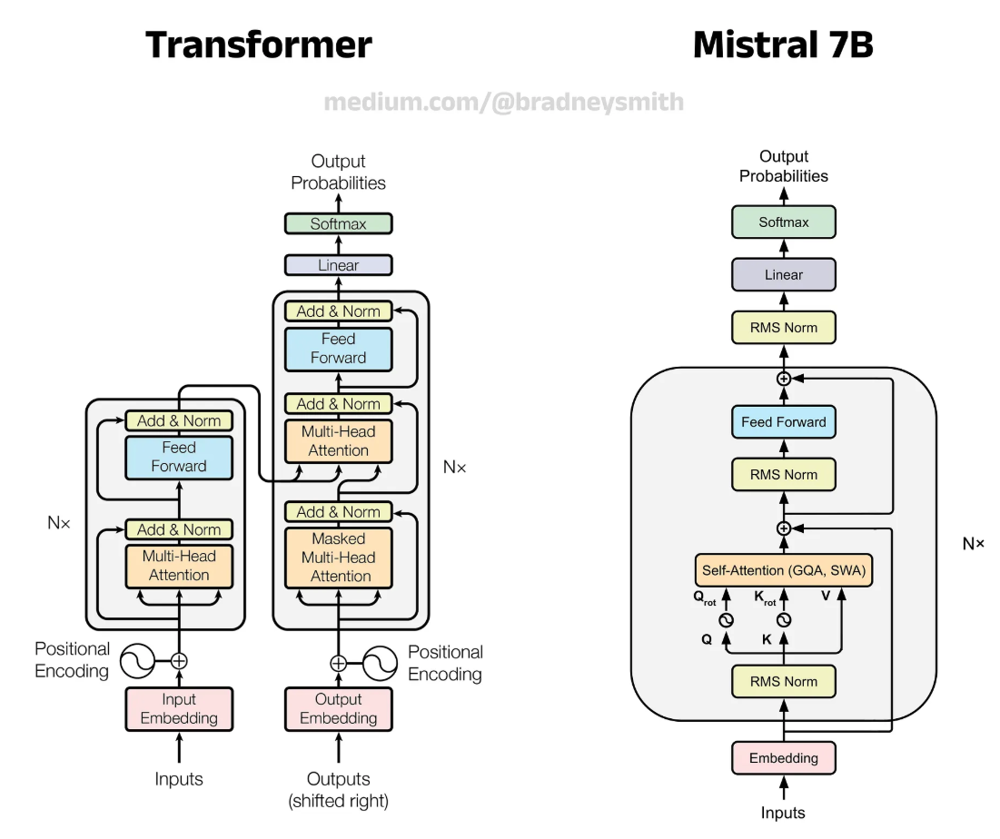
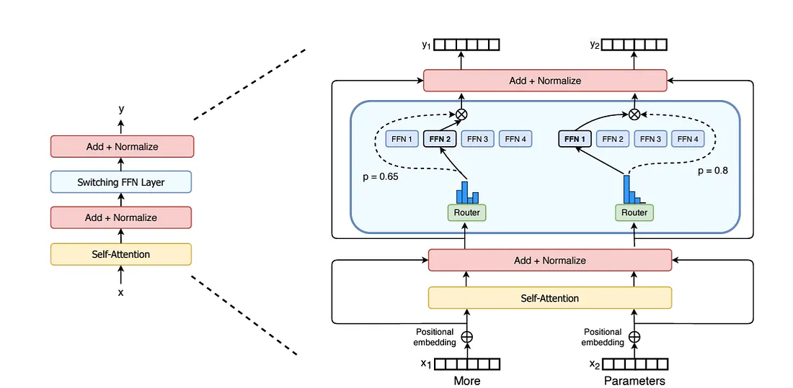

# Presentation: An Overview of Mistral AI

This document provides a concise overview of Mistral AI, its technology, model offerings, and strategic advantages for businesses.

---

### 1. What Makes Mistral AI Unique?

Mistral AI distinguishes itself in the competitive AI landscape through a combination of core principles and technological focus.

* **Open-Source at its Core*:** A significant portion of Mistral's models are released as open-weights under permissive licenses (like Apache 2.0). This fosters transparency, allows for community development, and enables companies to self-host and deeply customize models.
* **Focus on Efficiency:** best possible performance-to-cost ratio. Their models often outperform larger, more computationally expensive models from competitors on key benchmarks.

---

### 2. Key Architectural Innovations

Mistral's efficiency and performance are rooted in sophisticated architectural choices that optimize computation and context handling.

* **Sliding Window Attention (SWA):**
    * **What it is:** A technique used in models like Mistral 7B. Instead of every token attending to every other token in the context (which is computationally expensive), each token only looks at a fixed-size window of preceding tokens (e.g., the last 4,096 tokens).
    * **Advantage:** This dramatically reduces computation time and memory usage during inference, allowing for faster processing and a much larger effective context window at a lower cost, without a significant loss in performance for most tasks.

* **Mixture of Experts (MoE):**

    * **What it is:** An architecture used in models like Mixtral 8x7B and Mixtral 8x22B. The model is composed of multiple "expert" sub-networks. For any given token, a router network directs it to a small number of relevant experts (e.g., 2 out of 8).
    * **Advantage:** Only a fraction of the model's total parameters are used for any single inference. This allows for a massive increase in the total number of parameters (improving knowledge and reasoning) while keeping inference speed and cost comparable to a much smaller, dense model. It's how Mixtral 8x7B (47B total parameters) can process input as fast as a 13B parameter model.

---

### 3. Mistral AI's Model Portfolio

Mistral offers two primary categories of models: open-weight models for maximum control and commercial API models for ease of use and peak performance.

#### Open-Weight Models
*These models can be downloaded, modified, and self-hosted.*

| Model | Key Features & Use Case |
| :--- | :--- |
| **Mistral 7B** | - Highly efficient first model, outperforms larger models like Llama 2 13B.   - Ideal for simple tasks, summarization, and as a fine-tuning base. |
| **Mixtral 8x7B** | - Sparse Mixture-of-Experts (MoE) architecture.   - Offers the speed of a 13B model with the knowledge of a 47B model.   - Excellent for a wide range of tasks; multilingual and strong in code generation. |
| **Mixtral 8x22B** | - A larger, more powerful MoE model with a 64K token context window.   - Superior reasoning and knowledge capabilities.   - Suitable for complex enterprise workflows requiring deep analysis of large documents. |
| **Codestral** | - A specialized, open-weight model for code generation.   - Supports over 80 programming languages.   - Designed for IDE integration, code completion, and software development tasks. |

#### Commercial API Models
*Accessed via Mistral's "La Plateforme" API.*

| Model | Key Features & Use Case |
| :--- | :--- |
| **Mistral Small** | - Optimized for low latency and high-volume tasks.   - Ideal for simple applications like chatbots, text classification, and content generation. Outperforms Mixtral 8x7B. |
| **Mistral Medium** | - A high-performance model suitable for a wide variety of tasks.   - Provides a strong balance of performance, cost, and latency. |
| **Mistral Large** | - The flagship, top-tier model with leading reasoning capabilities.   - Directly competes with models like GPT-4 and Claude 3 Opus.   - Excellent for complex reasoning, multilingual tasks, and enterprise-grade applications. |
| **Mistral Embed** | - A specialized model for creating numerical representations (embeddings) of text for RAG and semantic search applications. |

---

### 4. When to Use Mistral vs. The Competition

Choosing Mistral depends on the specific priorities of your project.

* **Choose Mistral when:**
    * **Cost and Performance are Critical:** You need the best possible performance for your compute budget. Mistral's efficient models offer lower inference costs and faster speeds compared to similarly performing competitors.
    * **You Need to Fine-Tune:** Your application requires deep specialization on proprietary data. The open-weight models provide a powerful and cost-effective base for fine-tuning.
    * **Data Privacy & Control are Paramount:** You need to deploy the model on-premises or in a private cloud to maintain full control over data and ensure compliance (e.g., GDPR, HIPAA).
    * **You Require Transparency:** Your use case benefits from the ability to inspect and modify the model's architecture and weights.

* **Consider Competitors (like OpenAI, Google, Anthropic) when:**
    * **You Need the Absolute State-of-the-Art for Complex Reasoning:** For the most challenging reasoning tasks, models like GPT-4 may still hold a slight edge in some benchmarks, though Mistral Large is highly competitive.
    * **You Are Deeply Integrated into an Existing Ecosystem:** If your entire stack is built around a specific provider's tools and APIs, the switching cost might be a factor.
    * **You Prioritize Brand Recognition:** In some client-facing applications, using a widely recognized model name might be a preference.

---

### 5. Why Companies Should Use Mistral in Applications

1.  **Reduced Total Cost of Ownership (TCO):** 
2.  **Enhanced Data Security and Compliance:** 
3.  **Unparalleled Customization:** 
4.  **No Vendor Lock-In:** 
5.  **Competitive Performance:** 
---
