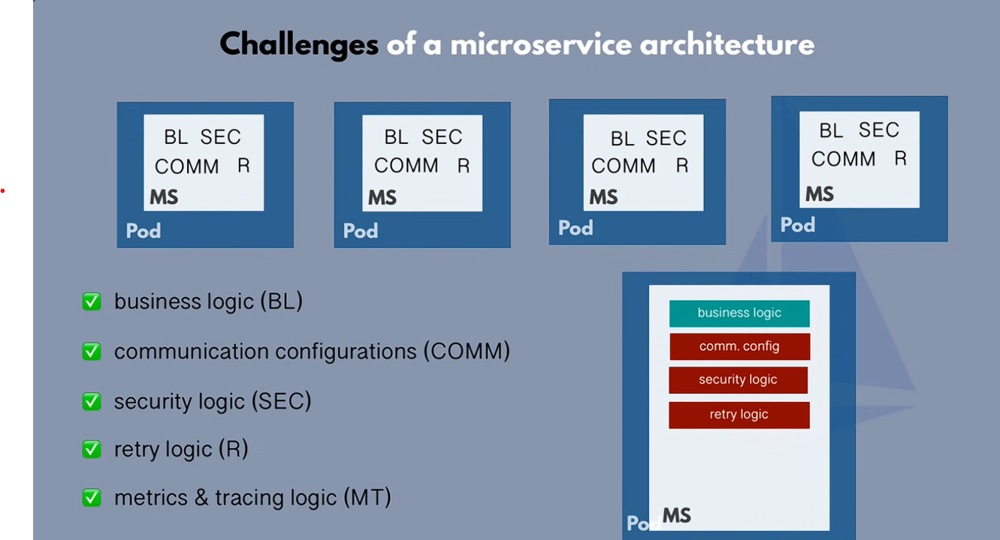

# Istio & Service Mesh 

---

## The Problem: Microservice Chaos 

Why do we need a service mesh? Because microservices introduce complex challenges:

* **Service Discovery:** How does `Service A` find `Service B` when pods are constantly changing?
* **Secure Communication:** How do you encrypt traffic and manage thousands of TLS certificates? 🛡️
* **Reliability:** What happens when a service fails? How do you prevent a single failure from taking down the entire system?
* **Traffic Management:** How do you safely roll out a new version without impacting all users? (e.g., Canary Releases).
* **Observability:** How can you understand what's happening across hundreds of services? It's a "black box." 📈

---

## The Solution: What is a Service Mesh? 
[text](serviceMesh.md)
A **service mesh** is a dedicated infrastructure layer that makes service-to-service communication safe, fast, and reliable.

* **Core Idea:** It inserts a lightweight network proxy, called a **sidecar**, next to each service instance.
* **How it Works:** All traffic between services is routed through these sidecar proxies.
* **Key Benefit:** It **offloads** complex network logic (retries, security, monitoring) from the application code into the sidecar. Developers can focus on **business logic**.
* **Components:**
    * **Data Plane:** The network of sidecar proxies (**Envoy**).
    * **Control Plane:** The "brain" that configures the proxies (**Istiod**).

---

## Istio: The Leading Service Mesh

**Istio** is an open-source, production-ready service mesh that transparently layers onto existing distributed applications.

* **Data Plane:** Uses **Envoy**, a high-performance proxy developed at Lyft.
* **Control Plane:** Uses **Istiod**, a unified binary that manages configuration, certificate distribution, and service discovery.

---

## Feature 1: Advanced Traffic Management 

Istio gives you fine-grained control over traffic flow.

* **Canary Releases & A/B Testing:**
    * Safely test new versions by sending a small percentage of traffic to them.
    * **Example:** `90%` of traffic to `v1`, `10%` to `v2`.
* **Dynamic Request Routing:**
    * Route traffic based on headers, cookies, or other request properties.
* **Resilience Features:**
    * **Retries:** Automatically retry failed requests.
    * **Timeouts:** Prevent a slow service from holding up the system.
    * **Circuit Breakers:** Quickly fail requests to an unhealthy service to prevent cascading failures.

---

## Feature 2: Zero-Trust Security 🛡

Istio provides a secure foundation for your microservices without requiring any code changes.

* **Automatic Mutual TLS (mTLS):**
    * **Encrypts** all traffic between services within the mesh by default.
    * **Authenticates** services using strong, automatically rotated certificates.
* **Authorization Policies:**
    * Define granular access control rules.
    * **Example:** "Only the `frontend` service is allowed to call the `payments` service."
* **Ingress/Egress Control:**
    * Manage and secure all traffic entering and leaving the mesh through an **Istio Gateway**.

---

## Feature 3: Deep Observability 

Understand the health and performance of your entire system out-of-the-box.

* **Automatic Telemetry:** Istio automatically generates detailed **metrics**, **logs**, and **traces** for all service traffic.
* **Key Metrics Collected:**
    * Latency (Request Duration)
    * Traffic Volume (RPS)
    * Error Rates (4xx, 5xx)
* **Powerful Tool Integrations:**
    * **Grafana:** For visualizing metrics on pre-built dashboards.
    * **Kiali:** To generate a real-time dependency graph of your mesh, showing how services interact. 

---

## How Do You Configure Istio? 

Configuration is done declaratively using Kubernetes **Custom Resource Definitions (CRDs)**. You just write YAML!

* **`VirtualService`:** Defines *how* you route traffic to a service. This is where you configure traffic splitting, retries, and timeouts.
* **`DestinationRule`:** Defines *subsets* (versions) of a service (e.g., `v1`, `v2`) and policies like load balancing.
* **`Gateway`:** Configures a load balancer at the edge of the mesh for ingress traffic.
* **`PeerAuthentication`:** Defines the mTLS mode for your services (e.g., `STRICT`).

---

## Conclusion: Why Istio? 

* **Solves Core Problems:** Addresses the key challenges of a distributed microservices architecture.
* **Separation of Concerns:** Keeps networking logic out of your application code, allowing developers to be more productive.
* **Platform-Level Control:** Provides powerful, consistent, and centralized control over all service communication.
* **The Payoff:** While there is a learning curve, Istio makes your microservices architecture more **resilient, secure, and observable**.
